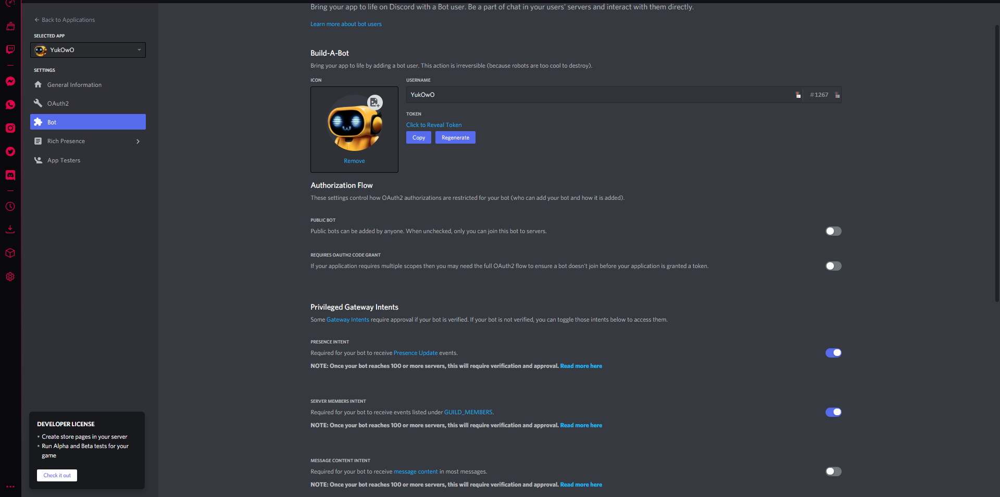
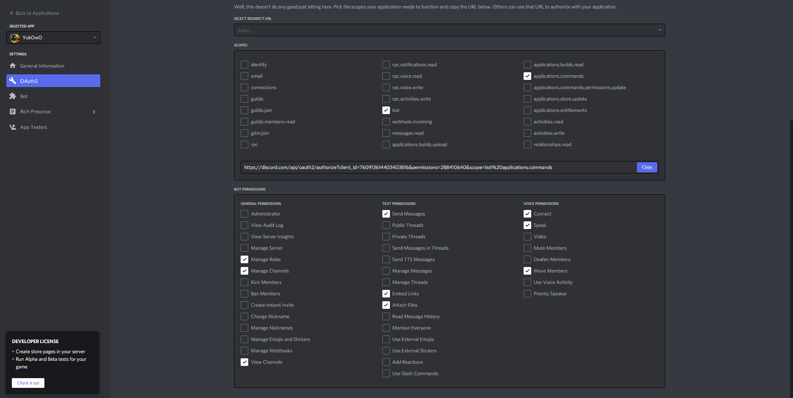

# Yuko

Yuko is a Discord bot based on JDA (Java Discord API). He works with League Of Legends and can give you precious tips on summoners, champions or the last patch note. Yuko can also sing, and plays YouTube audio on your channel. Let's discover what Yuko can do!

Yuko has been developed first for our private guild, but we decided to push our code public to help people like us, who would like to code their own bot in Java.

## Features and Slash commands
Yuko got many features, not only Slash commands. You can find here what Yuko can do.

### League of Legends

* `/champion <Champion's name>`: Get tips your favorite league champion,
* `/build <Champion's name>`: Get the recommended build for a league champion,
* `/summoner <Summoner's name>`: Get some info about a summoner,
* `/patch`: Get the last patch note.

If Riot Games API key has expired or if you didn't specify it (check **Set up your own Yuko** section), those commands won't be available.

You can enable/disable League of Legends commands with the commands `/settings`.

### Music
* `/play <YouTube link or title of the YouTube audio>`: Come to your channel and play a YouTube audio,
* `/volume <Volume value`: Set up the volume, must be a value between 1 and 100,
* `/player`: Get a player, like a radio,
* `/pause`: Pause/Resume the audio,
* `/skip`: Skip the current audio to the next,
* `/stop`: Stop the audio and clear the queue,
* `/queue`: Display the queue,
* `/clear`: Clear the queue,
* `/shuffle`: Shuffle the queue.

You can enable/disable Music commands with the commands `/settings`.

### Games
* `/flipacoin`: Flip a coin. Basic. Simple,
* `/w2p`: Ask everyone online if they want to play with you.

You can enable/disable `/w2p` command with the commands `/settings`.

### Administrative
* `/help`: Display all the commands available,
* `/info`: Get some info about Yuko's life,
* `/topic`: Get the topic of the current channel,
* `/uptime`: Get the time since I'm alive,
* `/ping`: Get my response time,
* `/rules <rule>`: Add or read rules of this guild,
* `/deleterules`: Delete all rules of this guild,
* `/settings`: Enable/Disable features with interactive buttons,
* `/to <Member> <Time in minutes>`: Time out someone (5 minutes if no time specified).

You can enable/disable `/to` command with the commands `/settings`.

With `/settings`, you can enable/disable some features if you are an admin, like `Welcomer` or `Yuko's jail`.  
`Welcomer` creates a text channel and a role for new joiner in the guild. It displays rules in this new channel and new member must agree those rules in order to see your guild. To enable this feature, you have to add rule(s) first for your guild.  
When you enable `Yuko's jail` to get the `/to` command, a role is created. In this role, you can do nothing, you are kicked temporarily. This role is added to all channels/categories when you enable it. Of course, only members who can manage roles can use this command.

## How it works
Yuko is programed in Java 11, but in order to run it on small devices like Raspberry Pi 3+/4, it's compatible with Java 8. We're currently using 3 externals API:
* JDA (Java Discord API): https://github.com/DV8FromTheWorld/JDA
* LavaPlayer: https://github.com/sedmelluq/lavaplayer
* Orianna: https://github.com/meraki-analytics/orianna

LavaPlayer is an audio player library for Discord.  
Orianna is the Java adaptation of the Riot Games League of Legends API.

## Invite Yuko
Yuko is currently offline because we are testing him, but you can still see the beta version on our guild!

## Set up your own Yuko
If you want to build your own Yuko and use our code, you need to follow several steps.

### Discord API key
Create a new application on Discord Developer Portal, go to **Bot** section, select **Presence Intent** and **Server Members Intent** and copy your secret token.  
https://discord.com/developers/applications

### Riot Games API key
If you want to use our League Of Legends features, you need to get a Riot Games API key by creating an app and register your product (whereas they give you a 24h test key).  
https://developer.riotgames.com

### Build
Build your code with Gradle and Java 11. If you want to build a `.jar`, we advise you to use Gradle Shadow. We're currently using it to build our `.jar`, all the libraries in the `gradle.build` file are already set. Just build the `.jar` with `./gradlew shadowJar`  
https://github.com/johnrengelman/shadow

### Running
There is 2 arguments specific to Yuko in our code:
* `--discord-token=DISCORD_API_KEY`: specify your Discord API key (secret token).
* `--riot-token=RIOT_API_KEY`: specify your Riot Games API key.

To run your `.jar`:  
`java -jar path/to/.jar --discord-token=DISCORD_API_KEY --riot-token=RIOT_API_KEY -Dfile.encoding=utf-8 -encoding utf8`  

We added `-Dfile.encoding=utf-8 -encoding utf8` because we had problems with accents encoding.  

Your Yuko should be alive, to add him to a guild, go to your application in Discord Developer Portal in **OAuth** section, select **bot** and **applications.commands** and also these following permissions:
* Manage Roles
* Manage Channels
* View Channels  

* Send Messages
* Embed Links
* Attach Files

* Connect
* Speak
* Move Members

If you don't want to give all these permissions to your Yuko, don't worry, you can still select each permission you want to give by managing Yuko's role in the guild's settings.  
Finally, you can invite your bot in guilds by copying the link just above **OAuth2 scopes**. The link should look like this:  
https://discord.com/api/oauth2/authorize?client_id=XXX&permissions=288410640&scope=bot%20applications.commands

And that's all, just run your build, and you will see your bot appears in your guild!

## Contributors
* Dev: **Chronoxios#5235**, **pirakao8#1272**
* UX Designer: **Flo#2478**
* Other: **Sioohz#3741**, **Neilor#8309**

## You want to help us?
If you want to help us to improve Yuko, report a bug, ask questions or simply talk with us, you can join Yuko's server: https://discord.gg/2VVeuY2ryz

